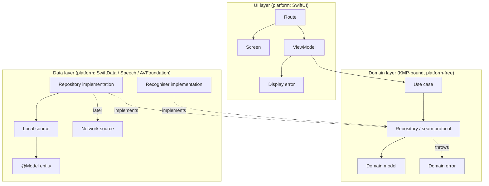
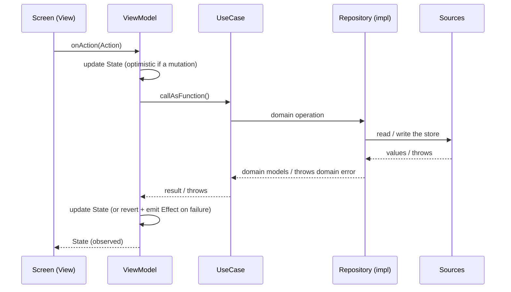

# Feature Architecture: MVI + Clean Architecture

This is the reference architecture for building a feature in MandoJiao. It combines
**Clean Architecture** layering with a **Model-View-Intent (MVI) / Unidirectional
Data Flow (UDF)** presentation layer. Every new feature should follow this shape so
the codebase stays consistent, testable, and ready for a possible move to Kotlin
Multiplatform (KMP).

The names below (`Feature`, `Thing`, etc.) are placeholders. Substitute the real
feature name when you apply the template.

> [!NOTE]
> The app is not on KMP, and there is no Android app. Several decisions here are made
> *in anticipation* of sharing the domain layer via KMP. Those decisions are flagged
> with **KMP:** and explained, because they are the main reason the code looks the way
> it does rather than the shortest possible Swift.

> [!NOTE]
> The app is not on this architecture yet either. It is the target. What exists today
> is described in [exercises.md](exercises.md), and how far the code has moved is in
> [modularisation-migration.md](modularisation-migration.md).

> [!TIP]
> This document is the reasoning. The same rules in checkable form, one assertion per
> line, are in [feature-checklist.md](feature-checklist.md), which is what to walk when
> reviewing a change.

---

## Contents

1. [Guiding principles](#guiding-principles)
2. [The three layers](#the-three-layers)
3. [Unidirectional data flow](#unidirectional-data-flow)
4. [Design decisions and rationale](#design-decisions-and-rationale)
5. [Module placement](#module-placement)
6. [Testing strategy](#testing-strategy)
7. [KMP interop cheat-sheet](#kmp-interop-cheat-sheet)
8. [References](#references)

---

## Guiding principles

1. **The dependency rule.** Source-code dependencies point *inward*, toward the
   domain. The domain knows nothing about the data or UI layers; the data and UI
   layers depend on the domain, never the reverse. Everything platform-specific
   (SwiftData, the Speech framework, AVFoundation, SwiftUI) lives at the edges.
2. **Unidirectional data flow.** State flows down to the view; intents flow up as
   actions. There is exactly one source of truth for a screen's state, and the view
   is a pure function of it.
3. **Depend on abstractions.** Layers talk to each other through protocols, not
   concrete types. This is what makes the layers independently testable and what
   lets the platform-specific implementation be swapped (including for a Kotlin one
   later). `SpeechRecognising` already works this way.
4. **Separation of concerns by layer.** Each layer has one job. Business rules live
   in use cases and domain types, data orchestration in the repository
   implementation, and view logic in the view model. None of them leak into the
   others.
5. **Testability by construction.** If something is hard to test, the design is
   wrong. Dependencies are injected, side-effecting boundaries sit behind protocols
   or closures, and timing is parameterised.
6. **KMP-readiness.** The domain layer is written so it could be lifted into a shared
   Kotlin module with minimal change. The data and UI layers stay platform-specific.
7. **Headless-ready.** Everything except the views can run on a Mac with no simulator.
   A screen's behaviour is then something a test or an agent can drive by sending
   actions and reading state and effects, in milliseconds rather than minutes.
   Platform-bound work goes behind effects and seams so the logic never needs a
   device. This extends what the project already does with `swiftc` and the pure
   grading types. The rules are in
   [modularisation.md](modularisation.md#building-for-macos).

---

## The three layers



**Dependencies point inward:** the UI layer and the data layer both depend on the
domain layer. The domain layer depends on nothing.

### Domain layer: the core (KMP-bound)

This layer is pure business definition. It contains **no** platform types (no
`@Model`, no `ModelContext`, no `AVAudioSession`, no `SpeechAnalyzer`, no SwiftUI).
Written so it can be lifted into a shared Kotlin module later.

MandoJiao's domain is unusually rich for its size. Grading, lesson building, the
matching board and the mistakes-list rules are all domain, and most of it is already
Foundation-only.

| Component | Responsibility |
| --- | --- |
| **Domain model** | Plain value type the rest of the app reasons about. `WordPair`, `LessonRequest`, `MatchingPlan`, `SpeakingPlan`, `MatchingBoard`. Already-resolved shape, no storage concerns. |
| **Domain rule** | A pure type holding a business rule that is not a use case: `AnswerGrader`, `MatchingPlanBuilder`, `SpeakingPlanBuilder`, `AnswerStrictness`. Static functions over values, testable with no fakes at all. |
| **Repository protocol** | Defines *what* data operations exist, not *how* they happen. `async throws`. Returns domain models. Says nothing about SwiftData, or local vs network. |
| **Seam protocol** | A platform capability the domain needs but cannot implement: `SpeechRecognising`, `MatchSoundPlaying`. Same rules as a repository protocol. |
| **Use case** | One business action, invoked via `callAsFunction`. Thin: applies a business rule and delegates to the repository. `async throws` (untyped). |
| **Domain error** | A bare, `Sendable` classification of a failure *cause* (e.g. `persistence` vs `unexpected`), carrying a portable, primitive error descriptor. No `LocalizedError` copy, no logging. |

### Data layer: orchestration (platform-specific)

This layer implements the domain's protocols using real infrastructure. It stays in
Swift; it does **not** go to KMP.

| Component | Responsibility |
| --- | --- |
| **Entity** | Persistence model (SwiftData `@Model`): `VocabWord`, `Deck`. Never leaves the data layer. Mapped to a domain model (`VocabWord.pair`) before anything else sees it. |
| **Local source** (protocol + impl) | Talks to the store. A `@ModelActor`, so its `ModelContext` is private and off the main actor (see [decision 11](#11-the-local-source-keeps-its-context-private)). Returns domain models or plain values, never entities. |
| **Network source** (protocol + impl) | Does not exist. MandoJiao has no backend. If sync arrives, it slots in behind the repository and nothing above the data layer changes. That is the point of [decision 1](#1-the-repository-is-a-domain-protocol-orchestration-is-a-data-detail). |
| **Platform service** | Implements a seam protocol: `DictationRecogniser` for `SpeechRecognising`, `ToneEngine` for `MatchSoundPlaying`. Owns the framework it wraps and nothing else. |
| **Repository implementation** | Orchestrates the sources and **classifies raw errors into domain errors**: a `LocalStoreError` from the local source becomes `persistence`, anything else `unexpected`. The only place that knows the store exists. |

### UI layer: presentation (platform-specific)

MVI / UDF. Stays in Swift. Only the Route and Screen are iOS-bound. The view model,
state, action, effect and display error use no UIKit or iOS-only API, so they run
headlessly on macOS (see [principle 7](#guiding-principles)).

| Component | Responsibility |
| --- | --- |
| **State** | `Equatable` value type. The single source of truth for the screen. |
| **Action** | An enum of user intents (`onAppear`, `submit`, `tapMicrophone`, `retry`, …). |
| **Effect** | An enum of *one-shot* side effects (show an error, fire a haptic, navigate, dismiss) delivered through an `EffectChannel`. A presented sheet or dialog is not an effect: it lasts until dismissed, so it is state. |
| **ViewModel** | `@Observable @MainActor`. Reduces actions into state, launches use cases, drives seams, emits effects. Mints the **display error** from the domain error. `SpeakingViewModel` is the reference. |
| **Route** | Owns the view model and consumes its effects; wires in navigation, scene phase, and error presentation. The only stateful view. |
| **Screen** | Stateless. A pure function of `state` plus an `onAction` closure. Previewable. |
| **Display error** | The presentation error type (`LoggedError`, `LocalizedError`): owns the user-facing message *and* the logging call. Minted by the view model from the domain error. |
| **Factory** | The composition root for one screen: a stateless `enum` whose `makeRoute(dependencies:…)` builds the use cases, seams and view model and returns the Route. Everything arrives as an argument (`Dependencies`, navigation, input), so it holds nothing and never reaches for a global. |

---

## Unidirectional data flow



- **State** is durable and replayable; the view re-renders from it.
- **Effects** are one-shot and must *not* live in state (an error banner or a haptic
  should fire once, not replay on every re-render). That is why effects go over an
  `AsyncStream` and state over the observable property. The speaking lesson used to keep a
  `feedbackToken` counter in state purely to make a haptic fire; it is now a
  `.haptic` effect.
- **Optimistic updates:** for mutations, the view model updates state immediately,
  then reconciles with the store; on failure it reverts and emits an error effect.

---

## Design decisions and rationale

### 1. The repository is a *domain* protocol; orchestration is a *data* detail

The repository **protocol** lives in the domain layer and describes only *what* can
be done (`func words() async throws -> [WordPair]`). It says nothing about SwiftData,
caching or networking. The repository **implementation** lives in the data layer and
is the only component that knows what sources exist and how to combine them.

Why: callers (use cases, view model) depend on the *capability*, not the *mechanism*.
The mechanism can change (add iCloud sync, add a backend, swap SwiftData) without
touching the domain.

> **KMP:** the protocol is domain, so it moves to the shared Kotlin module. The
> implementation stays in Swift (it uses SwiftData). A Kotlin caller and a Swift
> caller both program against the same shared contract; the platform supplies the
> implementation. This only works because the protocol hides *how* the data is
> retrieved.

### 2. `async`/`throws`, not completion handlers

All asynchronous domain operations are `async throws`.

> **KMP:** Kotlin `suspend` bridges to Swift `async` (via SKIE), and Kotlin `@Throws`
> bridges to Swift `throws`. Writing the Swift contract as `async throws` today means
> the generated Kotlin interface will match it with no call-site churn.

### 3. Untyped `throws`, not typed `throws`

The repository and use cases use untyped `async throws`, not
`throws(SomeDomainError)`.

Why: two reasons converge.
- **KMP** does not support typed throws; a typed Swift contract could not be generated
  from Kotlin. Untyped throws is the shape that survives the boundary.
- **Cancellation.** With typed throws you cannot propagate `CancellationError`, so a
  cancelled operation would have to be mapped into your error enum. Untyped throws lets
  cancellation propagate naturally, and the view model ignores it (a speaking lesson closed
  mid-listen is not a failure to show the user).

The classification of *what kind* of failure occurred is done by value (the domain
error the repository throws), not by the type system.

### 4. Two errors: a domain error *and* a display error

This is deliberate and worth understanding, because it looks like duplication.

- **Domain error** (domain layer): a bare, `Sendable` enum that *classifies the cause*
  (e.g. `persistence` vs `unexpected`) and carries a portable, primitive descriptor
  (domain string, code, message). It has **no** user-facing copy, no
  `LocalizedError`, no logging. The repository throws it.
- **Display error** (UI layer): conforms to `LoggedError` and `LocalizedError`. It
  owns the **user-facing message** and the **logging call**. The view model mints it
  *from* the domain error.

Why split them:
- The domain error is part of the KMP-bound layer, so it must stay free of
  presentation. Keeping copy and logging out of it keeps the domain portable.
- Messaging and reporting are *presentation* concerns. The view model is the right
  place to decide the copy the user sees and what to log.

So the flow is: the data layer *classifies* the cause (portable), and the
presentation layer *decides display and logging* from that classification
(platform-specific). Neither concern leaks into the other.

Store writes used to be saved with `try?`, so a failure vanished. They now reach the
user as an alert and the device log through `ErrorLog`, and a crash reporter added
later plugs into that seam without touching a view model. `VocabularyError.performing`
is the one place the mint, log, show sequence is written.

> **KMP:** the domain error becomes a Kotlin `sealed class`; only the repository's
> mapping (raw platform error to classification) is rewritten per platform. The view
> model's handling is unchanged.

### 5. Local-first, no cache layer (yet)

MandoJiao is offline. The SwiftData store is the source of truth, not a cache of
one, so there is no staleness, no sync marker and no background refresh. A repository
over a local source alone is the design today.

If a backend or sync arrives, the repository becomes the place that decides
cache-first vs network, and the rules come back: a **sync marker** per data set so an
empty store can be told apart from a failed fetch, stale-while-revalidate reads, and
write-through on mutation. None of that changes the domain contract, which is why
the contract must never mention the store.

### 6. Mutations write through the repository

When the user changes something (edits a word, finishes a lesson, clears mistakes),
the change goes through a use case to the repository, which writes the store in the
same operation. Views never call `context.insert`, `context.delete` or
`context.save`.

Why: four views used to mutate the store directly. Routing writes through one type
means one place to get the save right, one place to classify its failure, and one
place a future sync hooks in.

### 7. Observing the store without `@Query`

`@Query` is a SwiftUI property wrapper. It cannot live in a view model, and it ties
the view directly to the entity type. Its replacement is a repository method that
returns an `AsyncStream` of domain models, re-emitting after each write:

```swift
nonisolated protocol VocabularyRepository: Sendable {
    func vocabulary() -> AsyncStream<Vocabulary>
    func recordResults(_ results: LessonResults) async throws
    // …the other writes
}
```

Each subscription starts with the current snapshot, and every write through the
repository publishes a new one to every subscriber, so the home screen, the library
and a deck open at the same time stay in step. The view model subscribes on
`.appeared` and cancels on `.disappeared`, folding each snapshot into state. This is
the one place the pattern costs more than it saves in a small app: `@Query` is
genuinely less code. The trade is taken for testability and because an observable
stream is also the KMP shape (`Flow` bridges to `AsyncSequence`).

### 8. Route / Screen split

The **Screen** is a stateless `View` taking `state` and `onAction`. The **Route** owns
the view model, consumes effects, and wires environmental concerns (navigation, scene
phase, error presentation, haptics).

Why: a stateless screen is trivial to preview and to test in isolation, and all the
stateful wiring is quarantined in one place. `SpeakingScreen` and `SpeakingRoute` are the
reference.

### 9. Effects through a channel; state over the observable property

State is durable and drives rendering; effects are one-shot (show error, fire a
haptic, dismiss). They use different channels so a one-shot action does not replay
when the view re-renders.

State is `Equatable` besides, so assigning the same error twice is not a change and the
second identical failure would show nothing. Two yields are two events. This is
exactly what the speaking lesson's old `feedbackToken` worked around: two wrong answers in a
row leave `phase` equal, so a counter had to force the haptic.

The transport is an `EffectChannel`, not a bare `AsyncStream` held by the view model,
and this is a deliberate departure from the pattern this document was ported from. A
Route consumes effects in `.task`, which SwiftUI cancels whenever the view disappears,
and that includes another screen being pushed over it. Cancelling a consumer ends an
`AsyncStream` for good, so a home screen that had pushed the library once would
silently drop every effect afterwards: no navigation, no error, no log.

So `effects()` is a method. Each appearance takes a fresh stream, which replaces the
previous one, and an effect sent while nobody is listening is held for the next
listener. One consumer at a time is still the rule
([U5](feature-checklist.md#ui-layer-state-actions-effects)), but it is now enforced by
the channel rather than by convention, and the view model's lifetime no longer has to
match one `.task`'s.

### 10. Every source and platform service sits behind a protocol

The local source, the recogniser and the sound player are each a protocol plus an
implementation.

Why: the repository and view model can be unit-tested with fakes, and the protocols
are the natural seam if a source is ever reimplemented. `SpeechRecognising` was
written this way so `SFSpeechRecognizer` could replace `DictationTranscriber`, and
`ScriptedRecogniser` is already its fake.

### 11. The local source keeps its context private

The local source is a `@ModelActor`; its `ModelContext` is never exposed. It hands
out domain models or plain values, never `@Model` instances, which are not
`Sendable` and must not cross the actor.

Why: it keeps SwiftData fully encapsulated (the repository and everything above it
can never touch a context or an entity), and it moves store work off the main actor.
It generalises the rule the app already follows, that lessons are built from
`WordPair` and never from `VocabWord`.

### 12. The store schema is composed, not hard-coded

Each package that persists exposes its `@Model` types from its `{Feature}DI` target,
and the app builds the `ModelContainer` from the union. `CorePersistence` never names
a feature entity.

Why: SwiftData has no single model file, so unlike Core Data there is no readability
reason to co-locate entities in Core. Entities live with the feature that owns them.

Today `Library` is the only package that persists, so
`VocabularyRepositoryFactory.openStore` builds the container on its own. Composition becomes real when a second package
stores something.

Until the first release there is one schema, `VocabularySchemaV1`, and no migration
plan: the app is not live, so a change edits it, SwiftData infers the change where it
can, and the app is reinstalled where it cannot. From the
first release each package's schema is versioned with a `SchemaMigrationPlan`, and a
new version keeps every previous one in code, exactly as shipped, so an old store can
still be opened and migrated.

### 13. Dependency injection via a composition-root factory

A per-feature factory builds the whole graph (sources → repository → use cases →
view model → Route). The view never sees concrete data types.

The factory lives in `{Feature}DI`, not `{Feature}UI`. It is the only thing that names
a concrete implementation, so it has to see all three layers, and putting it in the UI
target would force a `UI` to `Data` dependency.

**Factories are stateless.** Each screen has a `public enum` conforming to one of the
route factory protocols in `CoreDI` (`RouteFactory`, `NavigationRouteFactory`,
`InputRouteFactory`, `NavigationInputRouteFactory`), named for what it takes beyond
`Dependencies`. A repository factory (`VocabularyRepositoryFactory`) hands out the
repository and any use case another package needs. `Dependencies` is a protocol in
`CoreDI`, and `LiveDependencies` in the app is its only production conformance.

State that must be shared lives in the data layer, not in a factory. Every screen asks
for the vocabulary repository, and `VocabularyStore` returns the same one per store,
because each subscription belongs to the repository it came through: two instances would
leave the library deaf to the word editor's saves. A test pins that.

A cross-package use case arrives as input. `SpeakingFactory` takes
`RecordLessonResultsUseCase` in `SpeakingInput`, because `Practice` may not import
`LibraryDI`; the app, which sees both, builds it and hands it over. Home, in `Progress`,
gets its library use cases in `HomeInput` the same way.

No lesson reaches a global: `SpeakingFactory` and `MatchingFactory` hand their view
models the recogniser, audio session and sounds. `MatchSounds.shared` is gone.

### 14. Test seams are injected, not hard-coded

Non-deterministic or environment-bound inputs (the recogniser, sounds, the
auto-advance delay, `Endpointing`'s settle window, clocks, `UserDefaults`) are injected
with sensible production defaults. Tests supply fakes or tiny values so they are fast
and deterministic.

### 15. Log an error where it originates; classify for the boundary

The repository *classifies* failures into the domain error; the view model decides
final display and logging from that classification. Avoid inspecting a platform
error type (`SwiftDataError`, `NSError`) in the view model; classify it in the data
layer and pass the classification up.

Concretely, the view model's handling of a failure is three steps in one place: mint
the display error, call `log()` on it, then yield the effect that shows it. All three,
every failing path, with cancellation caught first and ignored. An omitted `log()`
call is invisible: the user still sees the error and the console never hears about
it. Checkable form:
[E3 to E7](feature-checklist.md#ui-layer-errors-and-reporting).

`SpeechLog` is not an error log and is unaffected. It records every graded attempt,
right or wrong, because device console output is the primary evidence for grading
decisions.

---

## Module placement

The target shape is SPM packages: a shared **Core** package and one package per
feature area. The three layers above map onto targets, so the layer boundary and the
module boundary are the same line.

| Layer | Target | Holds |
| --- | --- | --- |
| Domain | `{Feature}Domain` | Domain models, domain rules, repository and seam protocols, use cases, domain error |
| Data | `{Feature}Data` | Repository implementation, local source, `@Model` entities, platform services, mapping |
| UI | `{Feature}UI` | Route, Screen, view model, state, action, effect, display error |
| (wiring) | `{Feature}DI` | The composition-root factory (see [13](#13-dependency-injection-via-a-composition-root-factory)) |

**A feature owns its whole vertical.** Everything for a feature, entities included,
lives in that feature's package. `{Feature}Domain` is the only target other feature
packages may depend on.

**Core owns mechanism, not features.** The audio engine, the SwiftData container
plumbing, design tokens. Core owns a *resource* only when it is genuinely app-level.
A resource with one real consumer belongs to that consumer, however generic it looks.
The recogniser has one consumer, the speaking lesson, so it lives in `Practice`, not Core.

**Share domain models, never entities.** An entity is the data layer's private
vocabulary for the current store schema; making it public turns that schema into a
cross-module contract. If a second caller needs the data, it calls the use case and
gets a domain model. This is the `WordPair`/`VocabWord` boundary, promoted to a
module boundary.

> **KMP:** `{Feature}Domain` is deliberately the same seam as a future shared Kotlin
> module: pure Swift, no `SwiftUI`, `SwiftData`, `Speech` or `AVFoundation` types,
> depending only on `CoreDomain`. The data and UI layers stay platform-specific Swift
> and never move to KMP. A UI import in a domain target is a "cannot be shared"
> signal, not a style nit.

> [!NOTE]
> Two worked examples, still in folders laid out like the targets to come.
> `Library/` is the full vertical: domain models, use cases and a
> repository protocol in `Domain/`, the `@ModelActor` local source, repository and
> versioned schema in `Data/`, four screens in `UI/`, and a stateless factory per screen
> in `DI/`.
> `Practice/`'s speaking folders show a view model driving platform seams (the recogniser, the
> audio session) and a settings repository. See
> [modularisation-migration.md](modularisation-migration.md#sequencing).
>
> Full rules and the target dependency table are in
> [modularisation.md](modularisation.md).

---

## Testing strategy

Each layer is tested in isolation through its seams. Tests use Swift Testing.

| Layer | What to fake | What to assert |
| --- | --- | --- |
| **Domain rules** | Nothing | Grading at every strictness, board dealing, plan building. The existing `AnswerGraderTests`, `StrictnessTests`, `MatchingBoardTests` and builder tests are already this. |
| **Repository** | The local source (protocol fake) | Mapping, error classification (`persistence` vs `unexpected`), cancellation propagating. |
| **Local source** | Nothing, use a real in-memory SwiftData container, through the repository | Round-trip, the mistakes-list arithmetic, deck membership. `VocabularyRepositoryTests`. |
| **Schema migration** | Nothing, migrate a copy of a real store from the previous version | Every record survives, and the migration's own fix-ups hold. None until the first release, which has no migrations. |
| **View model** | The use cases (via a fake repository) + the recogniser + injected timing | Action → state, the three-attempt rule, auto-listen after a correct answer, the heard-nothing rule, error effect emission. |

Notes:
- Back SwiftData tests with `ModelConfiguration(isStoredInMemoryOnly: true)`.
- The view model tests are where the gain is. The speaking lesson's microphone rules
  (auto-listening into the next word, not counting silence after an automatic listen,
  stopping when the app leaves the foreground) used to live in a view with no tests.
  `SpeakingViewModelTests` now drives them with a fake recogniser.
- Write view model tests so they could run on macOS: fakes for every use case and seam,
  and no UIKit. Once a package builds for macOS, those tests run without a simulator.
- The rule in [CLAUDE.md](../CLAUDE.md) still applies: clean before testing when a test
  file changed, and check the count moved.

---

## KMP interop cheat-sheet

How the Swift shapes chosen here map to a future shared Kotlin module (assuming
[SKIE](https://skie.touchlab.co)).

| Kotlin | Swift | Notes |
| --- | --- | --- |
| `suspend fun` | `async` | SKIE bridges to `async/await`; without SKIE it is a completion handler. |
| `@Throws(...)` | `throws` (untyped) | Kotlin needs `@Throws` for the error to surface in Swift at all. |
| typed throws | n/a | Not exported. Use untyped `throws` + a thrown classification value. |
| `sealed class` | exhaustive `enum` | The domain error, `AnswerStrictness` and `SpeakingLesson.Phase` shapes become sealed classes → Swift enums via SKIE. |
| `Flow` / `StateFlow` | `AsyncSequence` | Via SKIE. This is why store observation is an `AsyncStream`, and why `SpeechRecognising.partialText` would become a stream of partials rather than an observable property. |
| `data class` (primitives) | reference type | Kotlin data classes bridge as classes, not structs, so keep shared models primitive and `Sendable`. `WordPair` qualifies. |
| `kotlin.Result` | n/a | Not exported; do not put it in the shared contract. |
| coroutine cancellation | `Task` cancellation | SKIE bridges both directions. |

The practical upshot: keep the domain contract to `async throws`, classify failures
with a bare `Sendable` value (not a platform error type or typed throw), and keep all
platform persistence, audio and recognition out of the domain.

**What would actually be shared.** `AnswerGrader`, `AnswerStrictness`, the two lesson
builders, `MatchingBoard`, the mistakes-list arithmetic and the plan types. The grader is
the part most worth sharing, because two platforms grading the same answer differently
would be a visible bug. The caveat is that its levels were tuned against transcripts
from Apple's `DictationTranscriber`. Another platform's recogniser pads, spaces and
second-guesses differently, so shared code does not mean shared tuning; each
platform's transcripts need replaying through the levels before trusting them.

---

## References

These match this architecture closely; read them for the underlying reasoning.

- **Robert C. Martin, "The Clean Architecture."**
  <https://blog.cleancoder.com/uncle-bob/2012/08/13/the-clean-architecture.html>
  The dependency rule and the concentric-layer model this document is built on.
- **Google, "Guide to app architecture."**
  <https://developer.android.com/topic/architecture>
  The closest published match to this design, despite being Android: UI layer with
  UDF and a single source of truth, an optional domain layer of use cases, and a data
  layer of repositories orchestrating data sources. See especially the
  [UI layer](https://developer.android.com/topic/architecture/ui-layer),
  [domain layer](https://developer.android.com/topic/architecture/domain-layer), and
  [data layer](https://developer.android.com/topic/architecture/data-layer) guides.
- **Now in Android (Google reference app).**
  <https://github.com/android/nowinandroid>
  A production-grade implementation of the guide above.
- **Hannes Dorfmann, "Reactive Apps with Model-View-Intent."**
  <https://hannesdorfmann.com/android/model-view-intent/>
  The MVI state/intent model our State/Action/Effect follows.
- **Point-Free: The Composable Architecture (TCA).**
  <https://github.com/pointfreeco/swift-composable-architecture>
  The closest Swift-native expression of UDF (State / Action / Effect + a reducer).
  We apply the same ideas without the library.
- **Kotlin Multiplatform: Swift/Objective-C interop.**
  <https://kotlinlang.org/docs/native-objc-interop.html>
  Why the domain contract is shaped for the boundary.
- **SKIE (Touchlab).**
  <https://skie.touchlab.co>
  Bridges `suspend`→`async`, sealed classes→exhaustive enums, and `Flow`→`AsyncSequence`,
  which is what makes the mappings in the cheat-sheet above hold.
