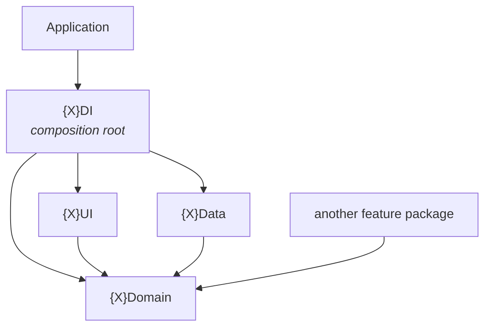

# Modularisation: packages, targets, and dependency rules

How the codebase is split into SPM targets, what each may depend on, and where a given
file belongs. These are the standing rules for the target shape.

- [architecture.md](architecture.md) covers the layering *inside* a feature (MVI +
  Clean Architecture). The two are aligned: the module boundary and the layer boundary
  are the same line.
- [modularisation-migration.md](modularisation-migration.md) covers where the code is
  today, the order things move in, and what is known to be untidy.

---

## The rule

> **A feature package may not depend on another feature package's concrete target.
> It may depend only on that package's `Domain` product.**

Google's Android guidance, adapted to SPM. No separate `api` target is needed:
`{X}Domain` already *is* the interface. `{X}Domain` is simultaneously the interface
seam and a future KMP `commonMain`, and concern targets scope framework dependencies
(SwiftData, Speech, AVFoundation) to the target that needs them.

---

## Feature package structure

| Target | Contains | Depends on | Imported by |
| --- | --- | --- | --- |
| `{X}Domain` | Domain models, domain rules, repository and seam protocols, use cases, domain errors | `CoreDomain`, peers' `Domain` | Anyone, including other packages |
| `{X}Data` | Repository impls, local sources, `@Model` entities, platform services, mapping | `{X}Domain`, `CorePersistence`, `CoreSound` as needed | `{X}DI` only |
| `{X}UI` | Views, view models, state, actions, effects; the package's destination enum and navigation values | `{X}Domain`, `CoreUI`, `CoreDesignSystem` | `{X}DI` only |
| `{X}DI` | Stateless factories wiring repository → use cases → view model → Route; per-flow navigation constructors | all three above, plus `CoreDI` | `Application` |



**Take only the targets you need.** A package with no persistence and no platform
service has no `{X}Data`. `Settings` is the example: every setting it edits is owned by
the package that reads it, so it has only `UI` and `DI`.

**A package is a business area, not a screen.** It holds every screen, rule and store
of one part of the product, the way a team would own it. Inside a target, each
resource or exercise is a folder (`PracticeUI/Matching/`, `PracticeUI/Speaking/`), and
the folder boundary is a convention, not a compiler check. That trade is deliberate:
see [Feature packages](#feature-packages).

**Products.** `{X}Domain` is the only one peers may depend on. `{X}DI` is a product for
`Application` only. `{X}Data` is **never** a product.

**Rules that follow:**

- `{X}Domain` must not import `SwiftUI`, `UIKit`, `SwiftData`, `Speech`, `AVFoundation`
  or `OSLog`.
- `{X}UI` must not import `{X}Data`. If it needs to, the wiring belongs in `{X}DI`.
- `{X}Data` must not import `{X}UI`.
- Only `{X}DI` may name a concrete implementation type.
- Domain and UI targets must build for macOS. See
  [Building for macOS](#building-for-macos).

**Why `{X}DI` exists.** Something has to construct a repository from its sources and
hand use cases to a view model, and that something must see all three layers. Swift has
no Hilt, so the wiring is manual and needs a home. Keeping it out of `{X}UI` is what
preserves the UI-to-Data non-dependency.

**Keep the public surface small.** Moving code into a package makes everything
internal, so every `public` is a decision.

- `{X}Data` exposes one entry point and keeps its concrete types internal.
  `VocabularyStore` opens the container, seeds it and builds the repository; nothing
  outside `LibraryData` names `VocabularyRepositoryImpl` or an entity.
- `{X}DI` factories are stateless enums, one per screen, conforming to a `CoreDI` route
  factory protocol. `Application` builds each screen's navigation value, so `{X}UI` is
  also a product, for `Application` only. A screen from another package is an input
  closure declared in the consumer's `DI` (`HomeInput.settings`).
- `{X}Domain` is public nearly throughout, because it is the interface. Structs used
  from another target need an explicit `public init`; a memberwise init is internal.
- A test target uses `@testable import` for its own package's targets, so tests do
  not force anything public.

**Application may import `{X}DI`; a feature package may not.** `{X}Domain` hands out
*types*, which is all a peer needs because it receives instances by injection. `{X}DI`
hands out *instances*, which requires seeing implementations. Application is the root
that does the injecting, not a peer.

---

## Feature packages

One package per business area. The target shape, decided on 2026-10-07:

| Package | Owns | Targets |
| --- | --- | --- |
| `Library` | The learner's own words, decks and folders: the library tab, deck and folder detail, the word editor, the mistakes list, the store, the answer record, and each word's strength (`WordMemory`, bands, Mark as learnt). `WordPair`, `LessonRequest`, `LessonResults`, `Answer`. | all four |
| `Dictionary` | Reference data the learner did not write: CC-CEDICT, the HSK lists, the lexicon, the Dictionary tab and word page, and later Tatoeba sentences. Knows nothing of `Library`. | all four |
| `Practice` | Every exercise and the lesson that mixes them: matching, speaking (read aloud), flash cards, later tracing and translation. Grading, plan builders, the recogniser, each exercise's settings, and `MixedLesson`, which builds its own steps. | all four |
| `Progress` | What to do next and how it is going: Home, `TodayPlanner` and `TodayPlan`, later streaks, goals and rewards. | all four as needed |
| `Settings` | The settings screen. Edits each setting through the domain of the package that owns it. | `UI`, `DI` |

**Where it stands.** All six packages exist. See
[modularisation-migration.md](modularisation-migration.md#option-a-one-package-per-business-area).

**Why business areas, not one package per screen.** `Matching`, `Speaking` and
`Flashcards` were each a one-screen package, so the mixed lesson, which needs all three,
became a fourth package whose steps had to be built by the app and handed back in. Every
new exercise would have added a package plus app wiring. In one `Practice` package the
mixed lesson names the exercises directly. The cost: one exercise's folder can now
reach into another's internals, and nothing but review stops it.

**Word strength stays in `Library`.** Word rows show bands, and Home needs them too.
If strength moved to `Progress`, `Library` would need `ProgressDomain` and `Progress`
would need `LibraryDomain`, a cycle SPM rejects.

**`Dictionary` does not know about the library.** It never imports the library, so the
library can use `DictionaryDomain`. The two meet only through the app:

- **The dictionary's view of saved words** is `SavedReading`, an id with Hanzi and
  pinyin, streamed by a `SavedReadingsRepository` the library implements
  (`VocabularySavedReadings`). The page never sees a library word.
- **Adding or opening a reading** is a `ReadingEdit` (`.add(entry)` or `.open(saved)`)
  handed to an editor closure in `DictionaryVocabulary`. The app answers with the
  library's word editor, which opens a saved word by its id and reads it in itself.
- **What the library uses of the dictionary** arrives as one `DictionaryAccess` in
  `LibraryInput`: the dictionary, lexicon and HSK repositories, and the dictionary page as
  a screen closure. The library's DI cannot see `DictionaryData` or `DictionaryDI`, so the
  app builds it from `DictionaryRepositoryFactory`.
- **Seeding a fresh store with HSK 1** takes the syllabus as an argument to
  `openStore(hskWords:)`, read only when the store is empty.

**Settings are owned by the package that reads them.** Strictness and the card limit
belong to speaking, and rounds and pinyin visibility to matching, both in `Practice`;
lesson word filters belong to `Library`. The settings screen is a composition over those
domains. The alternative, `Settings` owning every preference, forces
`Practice → Settings → Practice`, which SPM rejects. Storage keys are unchanged from
`Preferences.Key`, and strictness raw values remain storage (see
[CLAUDE.md](../CLAUDE.md#decisions-already-settled)).

**The package is `Library`; its aggregate is still the vocabulary.** The rename moved the
package, its targets and products, and the package's navigation bundle, which is
`LibraryNavigation` like every `{X}Navigation`; the library tab's own navigation became
`LibraryTabNavigation`, after its folder, to make room. Other types keep their names
(`Vocabulary`, `VocabularyRepository`, `VocabularyError`, `VocabularySchemaV1`), because
they name the learner's word collection, not the package.

**A view two packages show goes in `CoreUI`, never in a peer's UI.** Home and the library
both offer `PractiseRows` and a `BandBreakdown`. A shared view names no feature type: the
breakdown takes any band with a title and a level, and colours come from
`Theme.strength(_:)`, as `LessonCompleteView` takes its own `Row`. OrbitRemit documents
the same rule and breaks it in its manifests by importing peers' UI umbrellas; this
project follows the document.

**Starting a lesson is a navigation event.** Home and deck detail say
`didRequestMatching` or `didRequestSpeaking`, and `Application` turns that into a
presentation of a `Practice` screen.

---

## Core package structure

One package, concern targets. Not sibling packages.

| Target | Contains | Membership test |
| --- | --- | --- |
| `CoreDomain` | Shared pure types: `MatchSoundPlaying`, `AudioSessionSwitching`, `DomainErrorModel`, `ErrorLog`, and the `Preferences` key registry, since the settings screen writes what both lessons read | Zero dependencies beyond Foundation |
| `CorePersistence` | SwiftData container plumbing: the `@ModelActor` base helpers, schema composition, in-memory configuration for tests | Names no feature entity |
| `CoreSound` | `ToneEngine` and the audio session | Implements `CoreDomain` seams, names no feature |
| `CoreDesignSystem` | `Theme`, `LessonProgressBar`, view primitives, wrappers over iOS-only view APIs | Needs nothing but SwiftUI, and builds for macOS |
| `CoreUI` | `EffectChannel`, `LoggedError`, `errorAlert`, and screens shared by more than one feature: `LessonCompleteView`, which takes its own `Row` type so Core never learns what a word is | Used by two or more packages |
| `CoreTestSupport` | `waitUntil`, `settle`, `EffectLog` | Test helpers with no feature in them |
| `CoreDI` | `Dependencies`, and the route factory protocols every screen's factory conforms to | DI primitives, never registrations |

There is no `CoreNetworking`, because there is no backend. Add a target when its first
real member exists, not in anticipation.

> [!WARNING]
> The persistence target must not be called `SwiftData`. It collides with Apple's.

**`CoreDomain` may hold platform glue, in files named for what they bridge.** A shared
KMP module has `commonMain` and `iosMain`, and a Swift bridge onto a shared type belongs
in the latter. The rule is the naming, not an exemption: glue goes in
`{Type}+{PlatformType}.swift` and never mixes into the portable declaration.

**Seams are for things the app must decide,** such as which sound engine plays and where
errors are logged. They are registered once, in `Application`, and injected from there.
A value baked into the build is read from `Bundle.main` instead.

---

## Building for macOS

> **Domain and UI targets must build for macOS as well as iOS.**

The aim is to run a feature's logic headlessly on a Mac. View model tests and agent
tooling can then drive a screen by sending actions and reading state and effects. That
takes milliseconds, with no simulator, no accessibility tree and no screenshots. The
project already leans on this by compiling the grading types with `swiftc`; this rule
extends it to whole screens.

| Target | What it means |
| --- | --- |
| `{X}Domain` | Nothing extra. It is already platform-free. |
| `{X}Data` | Should build for macOS. SwiftData, `Speech` and `AVAudioEngine` all exist there. `AVAudioSession` does not, which is why only `CoreSound` may touch it. |
| `{X}UI`: view model, state, action, effect, display error | No UIKit and no iOS-only API. The view model imports `Observation` for `@Observable`, not `SwiftUI`, so it never sees a view type. A platform-bound call (haptics, a settings URL) is an effect the `Route` performs, or a seam injected with a production default. |
| `{X}UI`: views | Cross-platform SwiftUI by default. An iOS-only modifier or UIKit bridge goes behind a `CoreDesignSystem` wrapper that compiles on both platforms. Never put `#if os(iOS)` in a feature view. |
| `{X}DI` | No UIKit. It builds the graph and returns the `Route`. |
| `CoreSound` | The one sanctioned `#if os(iOS)`: audio session configuration. Everything else in it compiles on macOS. |
| `{X}Tests` | A test that needs UIKit goes in its own file wrapped in `#if canImport(UIKit)`. The rest of the target then still builds for macOS. |

**A package opts in by listing `.macOS(.v26)` in `platforms`,** matching the iOS 26
floor the app already has. It changes nothing about the iOS build.

**Build for macOS with `xcodebuild`:**

```
xcodebuild -scheme PracticeDomain -destination 'platform=macOS' build
```

**A seam is what keeps a platform service out of a target.** `MatchSoundPlaying` and
`SpeechRecognising` are the pattern. A headless run registers fakes (`SilentSounds`,
`ScriptedRecogniser`). Reach for one before importing a framework into a layer target.

---

## Concurrency settings per target

The app target sets `SWIFT_DEFAULT_ACTOR_ISOLATION = MainActor`. Packages set it per
target in `swiftSettings`, and the right answer differs by layer:

| Target | Default isolation | Why |
| --- | --- | --- |
| `{X}Domain` | nonisolated | Grading and plan building are pure and should run anywhere. Also the KMP shape. |
| `{X}Data` | nonisolated | Local sources are actors of their own. |
| `{X}UI`, `{X}DI` | `MainActor` | View models and routes are main-actor by nature. |

The trap in [CLAUDE.md](../CLAUDE.md#traps-specific-to-this-project) about default
arguments applies wherever `MainActor` is the default. It stops applying in domain
targets, which is one less place to get it wrong.

---

## Cross-feature dependencies

Two kinds of seam, in different places:

| Seam | Example | Declared in | Implemented in |
| --- | --- | --- | --- |
| **Behaviour** | Matching needs to record which words were missed | `{owner}Domain` (`LibraryDomain`) | `{owner}Data`, injected in `Application` |
| **Screen** | Home needs to open a matching lesson | a navigation closure in `{consumer}UI` | `Application` |

A view factory protocol must name a `View`, so it cannot live in `Domain` without
destroying its portability.

Package graph, target shape. Every arrow is to the peer's `Domain` product only:

```
Core        <- everyone
Dictionary  <- Library, Practice   (Practice for Gloss, reading a typed meaning)
Library     <- Practice, Progress, Settings
Progress    <- Practice      (the TodayPlan the mixed lesson runs)
Practice    <- Settings
Settings    (no inbound edges)
```

Dependencies point down towards `Library` and `Dictionary`. Nothing points back up:
`Library` never imports `Practice` or `Progress`, so a lesson's numbers that Library
screens need (a board's size, the word floor) are handed in by the app as values.

This is the graph as built.

---

## Navigation

> **A screen names what happened. Only the composition root names where to go.**

A screen never builds its destination inline. It receives a `{Screen}Navigation`: a
struct of closures, one per way of leaving.

```swift
@MainActor
public struct HomeNavigation {
  public var didRequestMatching: (LessonRequest) -> Void
  public var didRequestSpeaking: (LessonRequest) -> Void
  public var didRequestSettings: () -> Void
}
```

**Closures are named for the event, not the destination.** `didRequestSpeaking`, never
`presentSpeakLesson`. The moment a name says where it goes, the screen has taken a
position on a stack it cannot see, and the same screen can no longer serve two flows.
`SpeakingNavigation`, `MatchingNavigation`, `HomeNavigation` and `DeckDetailNavigation`
are all of this shape.

**One bundle per package.** `{X}Navigation` holds one member per screen, so a factory
signature stays at a single navigation parameter however many screens the package
gains. Every package with a screen that has a way out has one, even with a single screen:

| Bundle | Members |
| --- | --- |
| `ProgressNavigation` | `home` |
| `LibraryNavigation` | `deckDetail`, `libraryTab` |
| `PracticeNavigation` | `matching`, `speaking`, `flashcards`, `mixedLesson` |

`Dictionary` and `Settings` have none: their screens are only closed or left with the back
button. `HomeFactory` and `LibraryFactory` take their whole bundle because each roots a
tab; a presented lesson's factory takes its own member. A folder in the
library gets its `FolderDetailNavigation` from `LibraryFactory`, since "a deck or folder
was opened" pushes onto the library's own stack rather than leaving the package.

The library is two columns, the tree beside a `NavigationStack`, not three. With a middle
column, re-entering it on iPhone sent its screen a disappear while it was still showing,
which ended the route's effects loop and live data; a lesson request then waited until
the screen next appeared.

**Flow constructors live in `{X}DI`,** named for the flow (`.app(...)`): the bundle's
`LibraryNavigation+Flows.swift` at the target root composes each screen's
`DeckDetailNavigation+Flow.swift` and `LibraryTabNavigation+Flow.swift` in its screen folder.
A constructor states what the flow does with each event, which is the decision, so it
takes the app's actions (present a lesson, dismiss one) rather than building screens.
A constructor belongs with the stack it navigates, which is not always the package that
declares the type.

**`AppNavigation` is the composition root's own bundle,** one property per package
(`progress`, `library`, `practice`), built once by `AppNavigation.main(coordinator:)`. It is the only place that sees every
package, so a cross-package jump (home to a lesson) is expressed there. App-level
presentation state, the lesson presented over home, lives in `AppNavigationCoordinator`
rather than in a view's `@State`, and `ContentView` only reads both.

**Never default a navigation closure.** A `= { }` at an injection site compiles, silently
does nothing at runtime, and is the most common defect this pattern produces. Make it a
compile error instead. An empty closure written *inside a flow constructor* is different
and fine, because it states that this flow wants nothing further; say so in a comment.

**Dismissal belongs to the presenter, not to navigation.** Whether a modal closes is not
knowable when a navigation value is constructed, so the wrapper that presents it owns
`dismiss()` and the injected navigation says only what should happen as well. The
lesson views' `onClose` is this already.

---

## Folder conventions inside a target

> **A folder names a resource. The target's own mechanism has no folder.**

Mechanism sits at the target root; resource-shaped code goes in a folder named for the
resource.

```
LibraryUI/
  LibraryNavigation.swift            <- the target's own mechanism
  DeckDetail/DeckDetailRoute.swift
  DeckDetail/DeckDetailScreen.swift
  DeckDetail/DeckDetailViewModel.swift
  Library/WordLibraryRoute.swift
  WordEditor/WordEditorScreen.swift
```

**Never create `Shared/`, `Common/`, `Util/`, `Helpers/` or `Client/`.** A folder you can
only name after its shared-ness has not been classified yet, and it will attract
everything. Add structure to a mechanism only when it earns it, and then split by role,
never into one bucket.

---

## Naming

**Names repeat across layers by design.** `Deck`, `DeckSummary`, `DeckRepository`,
`DeckDetailViewModel`, `DeckDetailScreen` is the ubiquitous language working, not
duplication. One grep finds the whole vertical.

**Data is named for the aggregate; UI is named for the task.** `HomeScreen` is right
even though its data layer says `VocabWord` and `Deck`.

**Existing names are not renamed for the sake of it.** `SpeakSession` splitting into
`SpeakingLesson` and `SpeakingViewModel` was a rename with a reason (it became two things); `WordPair`
becoming `Word` is not, and would churn every test for nothing.

**The one hard rule:**

> Never let two types with the identical *unqualified* name exist in modules that can be
> imported together.

Suffixes carry the layer, so `Deck` (entity) and `DeckSummary` (domain) is fine; two
targets both declaring `Deck` is not. Nested types never collide and are exempt.

**Filenames are unique too.** Two files with the same basename make jump-to-file a coin
toss. An extension in another target is named for what it adds.

**A flow file is plural when it composes and singular when it does not.** A bundle
constructor at a DI target's root is `+Flows`; a per-screen constructor in a screen
folder is `+Flow`.

---

## Deciding where code lives

**Placement is decided by consumers, not names.** Ask:

1. **How many independent consumers?** One means the whole vertical lives in that
   feature package and the Core question never arises. This is the common case.
2. **Is the second consumer real?** A preview or a test is not a consumer.
3. **Would deleting the feature delete this code?** If yes it belongs to the feature,
   however generic it looks. Deleting the speaking lesson would delete `AnswerGrader`, so it
   lives in `Practice` even though it is the most reusable code in the app.
4. **Which business area would own it?** A new exercise goes in `Practice`, a new
   reference source in `Dictionary`, a new goal or streak in `Progress`, anything the
   learner writes or that describes their words in `Library`. A new package is only for
   a new area of the product, never for a new screen.

### Share domain models, not entities

> The sharing level is the domain model and the use case, never the `@Model` type.

An entity is the data layer's private vocabulary for the current schema. **An entity
that has to be shared means the vertical has two implementations, not two consumers**;
the fix is for the second caller to use the use case.

**If a type appears to fit nowhere, it is usually two things welded together: a pure
contract and a platform implementation.** `ToneEngine` is the example already in the
code: `MatchSoundPlaying` is the contract, `ToneEngine` the implementation. Split it
and each half has an obvious home. Never invent a target named for shared-ness
(`CoreShared`, `CoreUtil`).

---

## Test targets

**One `{X}Tests` target per package**, organised by resource folder, mirroring the
source layout. Not one per layer.

**`{X}TestSupport`** sits at the package root beside `Sources/` and `Tests/`, declared
with `path: "TestSupport"`, because it is neither shipping code nor a test. It holds
shared test doubles and fixtures, depends on `{X}Domain`, and
is depended on by `{X}Tests` and peers' tests. `ScriptedRecogniser` belongs in
`PracticeTestSupport`; a fake `VocabularyRepository` belongs in `LibraryTestSupport`.
A peer's test target may also use a peer's `DI` product to reach real bundled data, as
`LibraryTests` does for the HSK list it installs into a real store. Source targets
never may. A fake
used by exactly one test file stays private to that file; hoist when a second consumer
appears.

Keep the test target macOS-buildable too, per [Building for macOS](#building-for-macos).
One test target per package means one UIKit import blocks the whole target.

> [!WARNING]
> Moving tests into packages changes where the test count comes from. The CLAUDE.md
> rule (clean, then check the count moved) applies per scheme, and the app scheme must
> list every package test target or those tests silently stop running with it.
